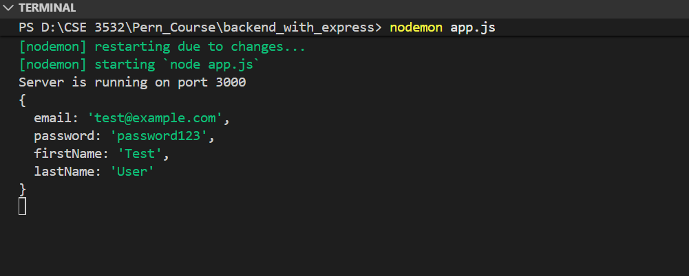
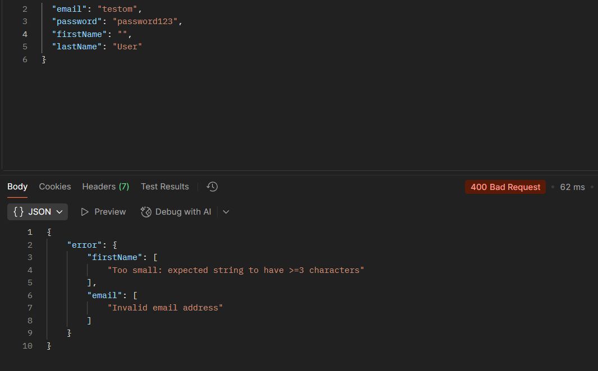
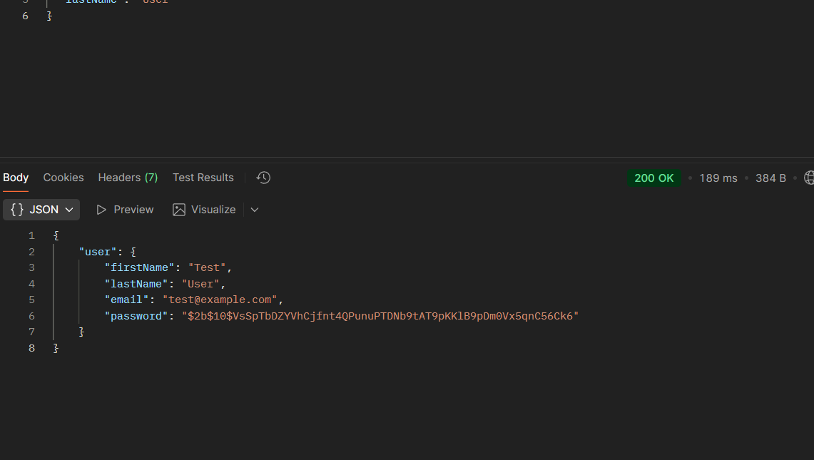

https://naimulcsx.notion.site/PERN-Stack-Mastery-Level-1-2bb2dc13fb6d80c78aa8d5bdb5c17c72?p=2bb2dc13fb6d80658154e7b8d17cca0a&pm=s&pvs=31 
for Schema Deifne "npm install zod "



Here’s the short comparison:

- **`safeParse`** → returns an object:  
  ```js
  const result = schema.safeParse(data);
  if (result.success) console.log(result.data);
  else console.log(result.error);
  ```
  ✅ No exceptions, structured success/error.

- **`parse` + try/catch** → throws on error:  
  ```js
  try {
    const result = schema.parse(data);
    console.log(result);
  } catch (err) {
    console.error(err.errors);
  }
  ```
  ⚡ Exceptions used for invalid data.

👉 Use **`safeParse`** for user input (predictable handling), and **`parse`** when invalid data should be treated as exceptional.

flatten().fieldErrors
[https://zod.dev/error-formatting ](https://zod.dev/error-formatting)



password hasing 
[https://www.npmjs.com/package/bcrypt](https://www.npmjs.com/package/bcrypt)




DB sathe connect jonno :
valo doc file 
[https://www.prisma.io/docs/getting-started/prisma-orm/add-to-existing-project/postgresql](https://www.prisma.io/docs/getting-started/prisma-orm/add-to-existing-project/postgresql)


